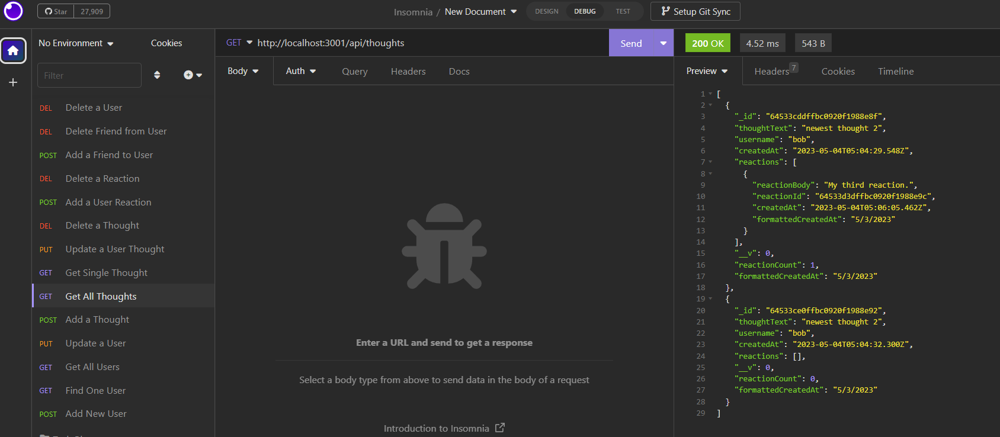

# Social Network API

## Description
An API for a social network web application where users can share their thoughts, react to friends’ thoughts, and create a friend list.

## Screenshot of Application

## Table of Contents
- [Installation](#Installation)
- [Usage](#Usage)
- [License](#License)
- [Contributing](#Contributing)
- [Tests](#Tests)
- [Questions](#Questions)
## Installation
Type "npm start" on the Terminal command line.
## Usage
Open the Terminal in VS Code, run "npm i". 

Go back to Bash in the Terminal and type "npm start" to run the app. Server routes can be tested at /api/users etc.
## License
This application is licensed under MIT.
## Contributing
If you would like to contribute to this project, email me at the address below.
## Tests 
None
## Questions
Please email me at johnwilday@yahoo.com with any questions. 
## Walkthrough Video Link
https://drive.google.com/file/d/1qr7PFjVcvODjvpwDmrz5TIkWyVBNFY1X/view

Github Repo: https://github.com/999888Z/social-network-api